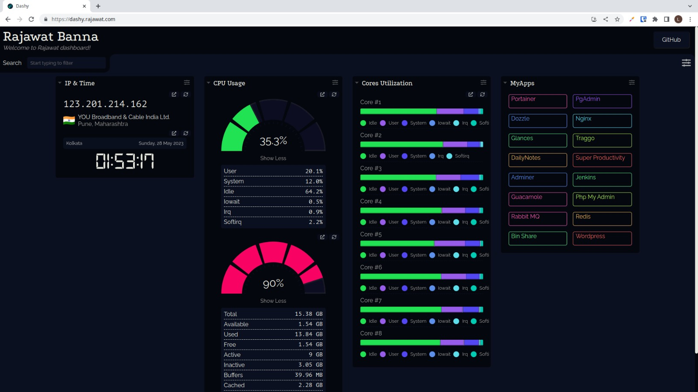

<div align="center" width="100%">
    <h1>Dashy Guide</h1>
    <p>An Awesome Home Dashboard</p>
</div>

🐳 [Docker-Hub](https://hub.docker.com/r/lissy93/dashy)
#



### Running a sample

```console
docker-compose up
```

To stop and remove all containers of the sample application run:

```console
docker-compose down
```

To stop and remove all containers with Volume of the sample application run:

```console
docker-compose down -v
```

## ✨ Dashy Config
#
```console
We have mounted all the volumes in dashyconf.
There in conf.yml where you have your own widgets and other configurations
```

## Author

## 👤 RajawatBanna
