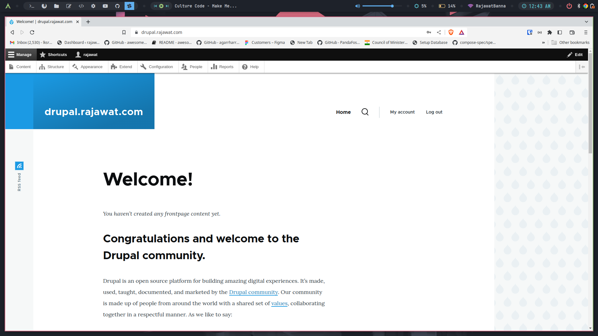

<div align="center" width="100%">
    <h1>Drupal Docker Guide</h1>
    <p>Some basic commands to use drupal docker container</p>
</div>

🐳 [Docker-Hub](https://hub.docker.com/_/drupal/)
#



### Running a sample

```console
docker-compose up
```

To stop and remove all containers of the sample application run:

```console
docker-compose down
```

To stop and remove all containers with Volume of the sample application run:

```console
docker-compose down -v
```

## 🎓 Drupal Configuration
#

1. Make Sure to modify the enviromental variable DRUPAL_TRUSTED_HOST to be configured according to your domain - [Reference](https://www.drupal.org/docs/getting-started/installing-drupal/trusted-host-settings)

```console
DRUPAL_TRUSTED_HOST: '^rajawat\.com$'
```

2. Before installation of drupal, you must have to create the extension pg_trgm using below command on your terminal

```console
docker exec -it drupaldb psql -U postgres -c "CREATE EXTENSION IF NOT EXISTS pg_trgm;"
GO
```


## Author

## 👤 RajawatBanna
