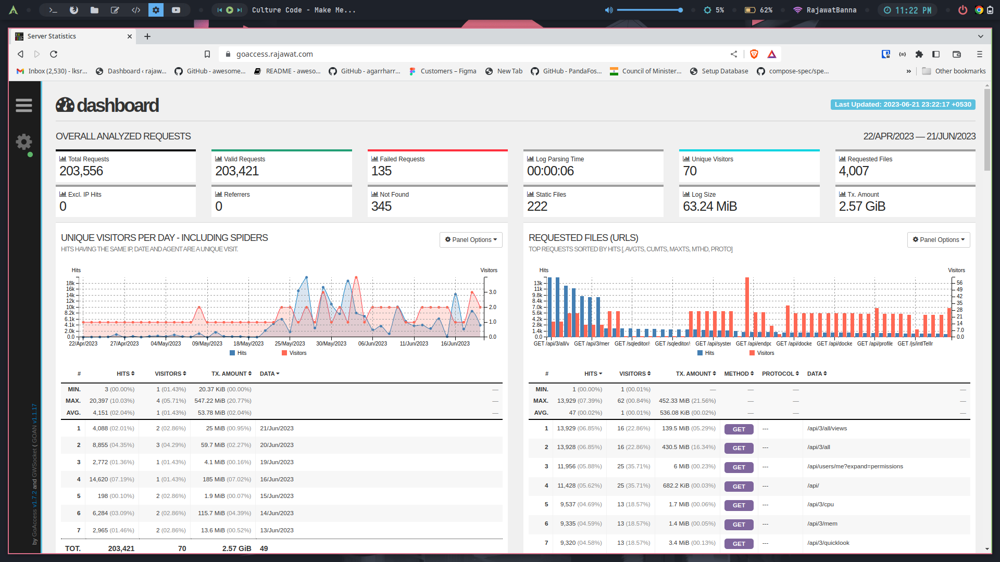

<div align="center" width="100%">
    <h1>Go Access For Nginx Proxy Manager</h1>
    <p>Awesome dashboard for logs of nginx proxy manager</p>
</div>

🐳 [Docker-Hub](https://hub.docker.com/r/justsky/goaccess-for-nginxproxymanager)
#



### Running a sample

```console
docker-compose up
```

To stop and remove all containers of the sample application run:

```console
docker-compose down
```

To stop and remove all containers with Volume of the sample application run:

```console
docker-compose down -v
```

## ✨ Nginx Proxy Manager Go Access Config
#
```console
Mount the /opt/log of this container to the /data/logs of nging proxy manager
```


## Author

## 👤 RajawatBanna
