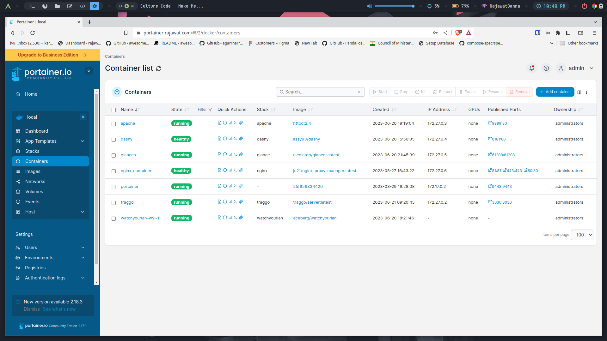

<div align="center" width="100%">
    <h1>Portainer-CE</h1>
    <p>Lightweight service delivery platform for containerized applications</p>
</div>

🐳 [Docker-Hub](https://hub.docker.com/r/portainer/portainer-ce)
#



### Running a sample

```console
docker-compose up
```

To stop and remove all containers of the sample application run:

```console
docker-compose down
```

To stop and remove all containers with Volume of the sample application run:

```console
docker-compose down -v
```

## ✨ Portainer Config
#
```console
We have mounted the volume in portainer_data.
```


## Author

## 👤 RajawatBanna
